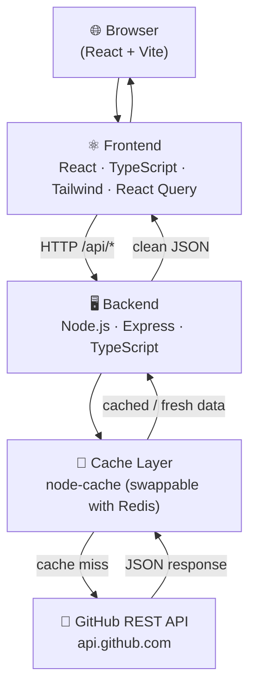

# GitFox 🦊

> **Explore any GitHub user's public profile and repositories through a beautiful, GitHub-inspired dark UI.**

GitFox is a full-stack application featuring a **React/TypeScript/Vite** frontend and a **Node.js/Express** backend proxy. The frontend never calls the GitHub API directly — all requests flow through the backend, which adds caching and error normalisation.

---

## Architecture



---

## Features

- 🔍 **Search** any public GitHub username
- 👤 **Profile card** — avatar, bio, location, follower/repo counts
- 📦 **Repository list** — language, stars, forks, topics, last updated
- 📂 **Expandable repo details** — issues, branch, size, created date
- 🔽 **Sort** by Stars, Name (A–Z), or Recently Updated (client-side)
- 📄 **Load More** pagination (30 repos per page)
- 💀 **Skeleton loaders** — no plain text "Loading…" spinners
- ⚠️ **Error handling** — not found, rate limit, network, empty state
- ⚡ **60-second cache** on the backend (per user + per page)

---

## Folder Structure

```
git-fox/
├── backend/
│   ├── src/
│   │   ├── cache/
│   │   │   └── cacheService.ts      # Abstracted cache (node-cache / Redis)
│   │   ├── middleware/
│   │   │   └── errorHandler.ts      # Global Express error handler
│   │   ├── routes/
│   │   │   └── github.ts            # GET /api/github/user/:u, /repos/:u
│   │   ├── services/
│   │   │   └── githubService.ts     # All GitHub API calls
│   │   ├── types/
│   │   │   └── github.ts            # Shared TypeScript interfaces
│   │   └── index.ts                 # Express bootstrap
│   ├── .env.example
│   ├── package.json
│   └── tsconfig.json
│
├── frontend/
│   ├── src/
│   │   ├── components/
│   │   │   ├── Header.tsx
│   │   │   ├── ProfileCard.tsx
│   │   │   ├── ProfileCardSkeleton.tsx
│   │   │   ├── RepoCard.tsx
│   │   │   ├── RepoCardSkeleton.tsx
│   │   │   ├── SortDropdown.tsx
│   │   │   └── ErrorMessage.tsx
│   │   ├── hooks/
│   │   │   ├── useGithubUser.ts     # React Query — user profile
│   │   │   └── useGithubRepos.ts    # React Query — infinite repos
│   │   ├── pages/
│   │   │   └── HomePage.tsx         # Main page orchestrator
│   │   ├── services/
│   │   │   └── api.ts               # Axios client → backend
│   │   ├── types/
│   │   │   └── github.ts            # Frontend TypeScript interfaces
│   │   ├── utils/
│   │   │   └── formatters.ts        # Date, number, size formatters
│   │   ├── App.tsx
│   │   ├── main.tsx
│   │   └── index.css
│   ├── .env.example
│   ├── index.html
│   ├── package.json
│   └── vite.config.ts
│
├── package.json                     # Root monorepo scripts
└── README.md
```

---

## Setup

### Prerequisites

- Node.js ≥ 18
- npm ≥ 9

### 1. Clone

```bash
git clone https://github.com/your-username/git-fox.git
cd git-fox
```

### 2. Install dependencies

```bash
# Backend
cd backend && npm install

# Frontend
cd ../frontend && npm install
```

### 3. Configure environment

```bash
# Backend
cp backend/.env.example backend/.env

# Frontend (only needed for production)
cp frontend/.env.example frontend/.env
```

### 4. Run in development

Open two terminals:

```bash
# Terminal 1 — backend (port 3001)
cd backend && npm run dev

# Terminal 2 — frontend (port 5173)
cd frontend && npm run dev
```

Or from the root (requires `concurrently`):

```bash
npm install   # installs concurrently
npm run dev
```

Open **http://localhost:5173** in your browser.

---

## Environment Variables

### Backend (`backend/.env`)

| Variable | Required | Default | Description |
|---|---|---|---|
| `PORT` | No | `3001` | Port the Express server listens on |
| `GITHUB_TOKEN` | No | — | GitHub PAT — increases rate limit from **60 → 5 000** req/hr. No scopes needed for public data. |
| `CACHE_TTL` | No | `60` | Cache duration in seconds |
| `FRONTEND_URL` | No | `*` | CORS origin (set to your Vercel URL in production) |

### Frontend (`frontend/.env`)

| Variable | Required | Default | Description |
|---|---|---|---|
| `VITE_API_BASE_URL` | No (prod only) | `""` | Base URL of the deployed backend (e.g. `https://git-fox-api.onrender.com`). Leave empty in development — Vite proxy handles routing. |

---

## Deployment

### Frontend → Vercel

1. Import the `frontend/` folder (or root with `frontend` as root directory) into Vercel.
2. Set `VITE_API_BASE_URL` to your Render backend URL.
3. Deploy.

### Backend → Render

1. Create a new **Web Service** pointing at the `backend/` directory.
2. Build command: `npm install && npm run build`
3. Start command: `node dist/index.js`
4. Add environment variables (`GITHUB_TOKEN`, `FRONTEND_URL`, etc.).
5. Deploy.

---

## API Reference

| Endpoint | Description |
|---|---|
| `GET /api/github/user/:username` | Fetch a user's public profile |
| `GET /api/github/repos/:username?page=1` | Fetch a page of public repos |
| `GET /health` | Health check endpoint |

---

## Tech Stack

| Layer | Technology |
|---|---|
| Frontend | React 18, TypeScript, Vite, Tailwind CSS v4 |
| State / Data | TanStack React Query v5 (infinite queries) |
| HTTP Client | Axios |
| Backend | Node.js, Express, TypeScript |
| Caching | node-cache (60 s TTL, Redis-ready abstraction) |
| Icons | Lucide React |

---

## License

MIT
